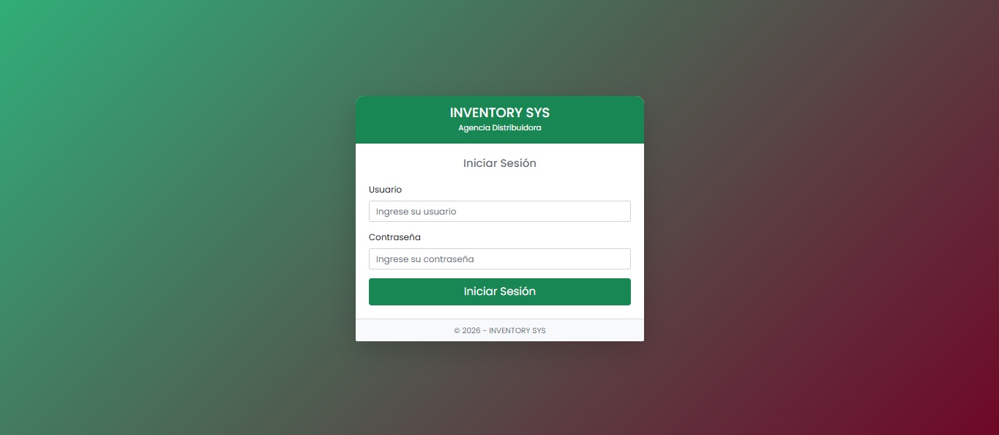

# 📊🧶 Sistema Web Full-Stack para Gestión de Inventarios, Ventas Mayoristas y Finanzas

¡Bienvenido! Este es un sistema web Full-Stack diseñado a medida para optimizar procesos comerciales, control estricto de stock por mayor/menor y flujos financieros en empresas distribuidoras y comercios.

> 🔒 **Nota sobre el código:** Este repositorio funciona exclusivamente como **portafolio y demostración visual** de la interfaz, arquitectura de software y lógica de negocio. El código fuente y las bases de datos se mantienen privados por razones de confidencialidad comercial.

---

## 📸 Demostración Visual (Capturas del Sistema)

*💡 **Tip para reclutadores:** Haz clic en las imágenes para ampliar los detalles.*

| Módulo | Captura de Pantalla | Descripción |
| :--- | :---: | :--- |
| **1. Acceso Seguro & Dashboard** |  | Autenticación basada en roles (**RBAC**). Redirección dinámica a paneles diferenciados para Administradores y Vendedores. |
| **2. Inventario Inteligente** | `` | Control detallado de paquetes/subpaquetes con conversión automática de unidades y alertas de stock bajo. |
| **3. Punto de Venta (POS)** | `` | Interfaz interactiva responsiva. Calcula tarifas dinámicas (mayor/menor) y registra extracciones en tiempo real. |
| **4. Finanzas & Cobranzas** | `` | Control automatizado de cuentas por cobrar, registro de abonos, emisión de comprobantes y balance de caja diaria. |

---

## 🚀 Arquitectura y Lógica de Negocio

El software resuelve desafíos reales del comercio mayorista mediante reglas de negocio avanzadas:

* 🏷️ **Precios Dinámicos:** Evaluación del carrito en tiempo real con JavaScript; aplica automáticamente tarifa mayorista al superar el umbral configurado (ej. +5 unidades).
* 📦 **Cálculo de Stock Empaquetado:** Conversión automática de paquetes masivos a unidades sueltas *(Ej. 22 paquetes × 10 unid + 2 sueltas = 222 totales)* para eliminar errores humanos.
* 🧾 **Tickets de Crédito con Multiextracción:** Permite agregar productos a un mismo ticket a lo largo del día, registrando la hora exacta de cada retiro antes del cierre total.
* 🔍 **Auditoría de Inventario Físico:** Módulo para comparar conteo físico vs. stock del sistema, generando reportes de diferencias (+/-) y ajustes directos en la BD.
* 🛡️ **Seguridad por Roles (RBAC):** 
  * **Administrador:** Gestión de usuarios, reseteo de credenciales y reportes financieros globales.
  * **Vendedor:** Operación del POS, cobro de abonos y reimpresión de recibos.

---

## 🛠️ Tecnologías Utilizadas

* **Frontend:** HTML5, CSS3, Bootstrap *(diseño adaptativo)*, JavaScript Nativo *(manipulación del DOM, peticiones asíncronas / Fetch API)*.
* **Backend:** PHP *(Programación Orientada a Objetos, gestión segura de sesiones, renderizado dinámico)*.
* **Base de Datos:** MySQL / MariaDB *(diseño relacional estructurado para consistencia de datos)*.
* **Entorno & Herramientas:** XAMPP (Apache/MySQL), phpMyAdmin, Composer, Git/GitHub.

---

## 👩‍💻 Autoría y Calidad (QA)

Diseñado e implementado con un enfoque riguroso en la **experiencia de usuario (UX)**, **testing exploratorio** y **estabilidad funcional**.

* **Desarrolladora Full-Stack & QA:** Valeria Evelin Guarachi Cori
* **Email de contacto:** [valeriaguarachi444@gmail.com](mailto:valeriaguarachi444@gmail.com)
* **LinkedIn:** [Tu Perfil de LinkedIn](https://linkedin.com/in/tu-usuario) *(Recomendado agregar)*

---
